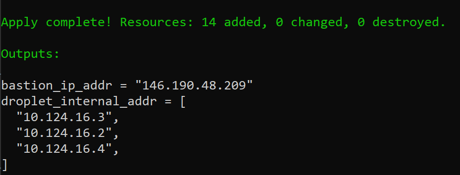
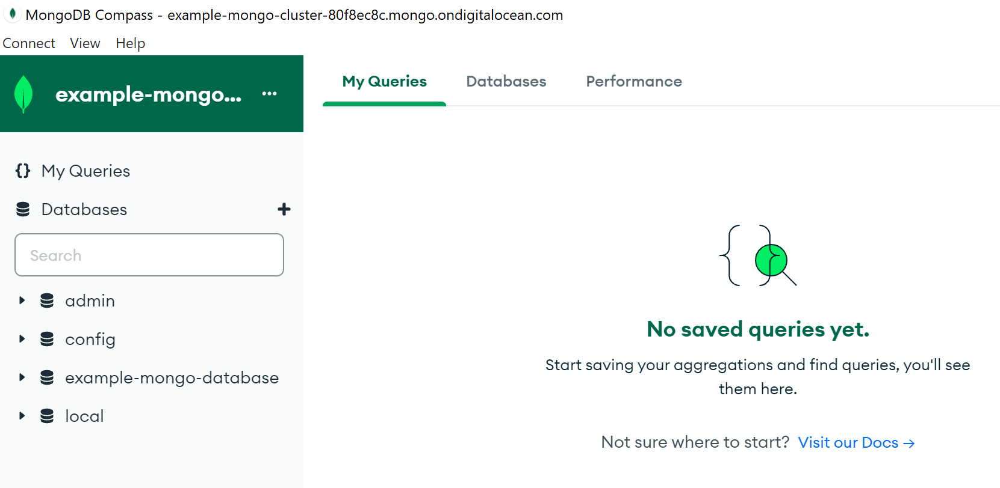
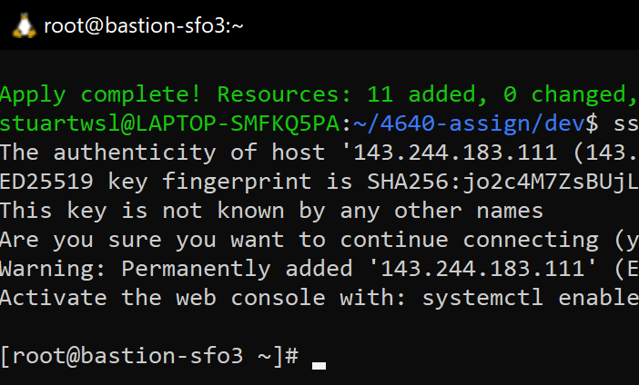

<b>Assumptions:</b>
- terraform is installed 
- SSH key named "my_key" attached to DigitalOcean account (or edit line 16 in main.tf)
- SSH key has correct permissions (chmod 400 or 600)
- project named 4640_labs exists

<h4>First</h4>

Initialize a git repository in ```~/``` with the following file:
- .gitignore

Add the following <b>folder</b> to the git repository:
- dev

Add the following files inside of ```/dev```:
- .env
- main.tf
- terraform.tvars
- variables.tf

<h4>Next</h4>

Open WSL in ```~/<gitrepo>/dev/.env``` and enter <code>terraform init</code
>
<h4>Next</h4>

Create a <b>DigitalOcean API Token</b> and keep track of its <b>authentication string</b>.

Open your .env file at ```~/<gitrepo>/dev/.env``` and put:
```
export TF_VAR_do_token=<your token authentication string>
```

<h4>Next</h4>

In the command line at ```~/<gitrepo>/dev``` enter: <code>source .env</code>

<h4>Next</h4>

In command line at ```~/<gitrepo>/dev``` enter: <code>terraform init</code>

<h4>Next</h4>

Open <b>main.tf</b> at ```~/<gitrepo>/dev/main.tf``` and put:


<details>
    <summary>
        main.tf
    </summary>

    terraform {
        required_providers {
            digitalocean = {
                source  = "digitalocean/digitalocean"
                version = "~> 2.0"
            }
        }
    }

    # Configure the DigitalOcean Provider
    provider "digitalocean" {
        token = var.do_token
    }

</details>

<h4>Next</h4>

Open <b>bastion.tf</b> at ```~/<gitrepo>/dev/bastion.tf``` and put:


<details>
    <summary>
        bastion.tf
    </summary>

    # firewall for bastion server


        resource "digitalocean_firewall" "bastion" {
        
        #firewall name
        name = "ssh-bastion-firewall"

        # Droplets to apply the firewall to
        droplet_ids = [digitalocean_droplet.bastion.id]

        inbound_rule {
            protocol = "tcp"
            port_range = "22"
            source_addresses = var.destination_addresses
        }

        outbound_rule {
            protocol = "tcp"
            port_range = "22"
            destination_addresses = [digitalocean_vpc.web_vpc.ip_range]
        }

        outbound_rule {
            protocol = "icmp"
            destination_addresses = [digitalocean_vpc.web_vpc.ip_range]
        }
    }

    # Create a bastion server
        resource "digitalocean_droplet" "bastion" {
        image    = "rockylinux-9-x64"
        name     = "bastion-${var.region}"
        region   = var.region
        size     = "s-1vcpu-512mb-10gb"
        ssh_keys = [data.digitalocean_ssh_key.my_key.id]
        vpc_uuid = digitalocean_vpc.web_vpc.id
    }

    # Add bastion to existing 4640_labs project
    resource "digitalocean_project_resources" "project_attach_bastion" {
        project = data.digitalocean_project.lab_project.id
        resources = [digitalocean_droplet.bastion.urn]
    }

</details>

<h4>Next</h4>

Open <b>database.tf</b> at ```~/<gitrepo>/dev/database.tf``` and put:


<details>
    <summary>
        database.tf
    </summary>

    resource "digitalocean_database_firewall" "mongodb-firewall" {
        
        cluster_id = digitalocean_database_cluster.mongodb-example.id
            # allow connection from resources with a given tag
            # for example if our droplets all have a tag "web" we could use web as the value
            rule {
            type = "tag"
            value = var.vpc_name
        }
    }


    resource "digitalocean_database_cluster" "mongodb-example" {
        name       = "example-mongo-cluster"
        engine     = "mongodb"
        version    = "4"
        size       = "db-s-1vcpu-1gb"
        region     = var.region
        node_count = 1

        private_network_uuid = digitalocean_vpc.web_vpc.id
    }


    resource "digitalocean_database_db" "database-example" {
        cluster_id = digitalocean_database_cluster.mongodb-example.id
        name       = "example-mongo-database"
    }

</details>

<h4>Next</h4>

Open <b>data.tf</b> at ```~/<gitrepo>/dev/data.tf``` and put:


<details>
    <summary>
        data.tf
    </summary>

    # Set the SSH key used
    data "digitalocean_ssh_key" "my_key" {
        name = "my_key"
    }

    # Set the project used
    data "digitalocean_project" "lab_project" {
        name = "4640_labs"
    }

    # Create a new tag
    resource "digitalocean_tag" "do_tag" {
        name = var.do_tag_name
    }


</details>

<h4>Next</h4>

Open <b>network.tf</b> at ```~/<gitrepo>/dev/network.tf``` and put:

<details>
    <summary>
        network.tf
    </summary>

    # Create a new VPC
    resource "digitalocean_vpc" "web_vpc" {
        name   = var.vpc_name
        region = var.region
    }

</details>

<h4>Next</h4>

Open <b>servers.tf</b> at ```~/<gitrepo>/dev/servers.tf``` and put:

<details>
    <summary>
        servers.tf
    </summary>

    # Create firewall for droplets 

    resource "digitalocean_firewall" vpc_name {

        # The name we give our firewall for ease of use                            #    
        name = "${var.vpc_name}-firewall"

        # The droplets to apply this firewall to                                   #
        droplet_ids = digitalocean_droplet.web.*.id

        # Internal VPC Rules. We have to let ourselves talk to each other
        inbound_rule {
            protocol = "tcp"
            port_range = var.port_range
            source_addresses = [digitalocean_vpc.web_vpc.ip_range]
        }

        inbound_rule {
            protocol = "udp"
            port_range = var.port_range
            source_addresses = [digitalocean_vpc.web_vpc.ip_range]
        }

        inbound_rule {
            protocol = "icmp"
            source_addresses = [digitalocean_vpc.web_vpc.ip_range]
        }

        outbound_rule {
            protocol = "udp"
            port_range = var.port_range
            destination_addresses = [digitalocean_vpc.web_vpc.ip_range]
        }

        outbound_rule {
            protocol = "tcp"
            port_range = var.port_range
            destination_addresses = [digitalocean_vpc.web_vpc.ip_range]
        }

        outbound_rule {
            protocol = "icmp"
            destination_addresses = [digitalocean_vpc.web_vpc.ip_range]
        }

        # Selective Outbound Traffic Rules

        # HTTP
        outbound_rule {
            protocol = "tcp"
            port_range = "80"
            destination_addresses = var.destination_addresses
        }

        # HTTPS
        outbound_rule {
            protocol = "tcp"
            port_range = "443"
            destination_addresses = var.destination_addresses
        }

        # ICMP (Ping)
        outbound_rule {
            protocol              = "icmp"
            destination_addresses = var.destination_addresses
        }
    }


    # Create droplets
    resource "digitalocean_droplet" vpc_name {
        image    = var.default_droplet_image
        count    = var.droplet_count
        name     = "${var.vpc_name}-${count.index + 1}"
        tags     = [digitalocean_tag.do_tag.id]
        region   = var.region
        size     = var.default_droplet_size
        vpc_uuid = digitalocean_vpc.web_vpc.id
        ssh_keys = [data.digitalocean_ssh_key.my_key.id]

        lifecycle {
            create_before_destroy = true
        }
    }

    # Add new web droplets to existing 4640_labs project
    resource "digitalocean_project_resources" "project_attach_servers" {
        project = data.digitalocean_project.lab_project.id
        resources = flatten([digitalocean_droplet.web.*.urn]) 
    }

    # Create load balancer for droplets
    resource "digitalocean_loadbalancer" "public" {
        name = "loadbalancer-1"
        region = var.region

        forwarding_rule {
            entry_port     = 80
            entry_protocol = "http"

            target_port     = 80
            target_protocol = "http"
        }

        healthcheck {
            port     = 22
            protocol = "tcp"
        }

        droplet_tag = var.do_tag_name
        vpc_uuid = digitalocean_vpc.web_vpc.id
    }


</details>

<h4>Next</h4>

In <b>terraform.tfvars</b> at ```~/<gitrepo>/dev/terraform.tvars``` enter:

<details>
    <summary>
        terraform.tvars
    </summary>

    droplet_count = 3
</details

<h4>Next</h4>

In <b>variables.tf</b> at ```~/<gitrepo>/dev/variables.tf``` enter:

<details>
    <summary>
        variables.tf
    </summary>
    
    variable "do_token" {}

    variable "region" {
        type = string
        default = "sfo3"
    }

    variable "droplet_count" {
        type = number
        default = 2
    }

    variable "destination_addresses" {
        type = list
        default = ["0.0.0.0/0", "::/0"]
    }

    variable "port_range" {
        type = string
        default = "1-65535"
    }

    varible "default_droplet_image" {
        type = string
        default = "rockylinux-9-x64"
    }

    varible "default_droplet_size" {
        type = string
        default = "s-1vcpu-512mb-10gb"
    }

    variable "vpc_name" {
        type = string
        default = "web"
    }

    variable "do_tag_name" {
        type = string
        default = "Web"
    }

</details


<h4>Next</h4>

In ```~/<gitrepo>/dev``` enter: <code>terraform apply</code>

<h4>Confirming Application Success</h4>

<code>terraform apply</code> should have returned success and relevant information retrievable with <code>terraform output</code>.



Database should be accessible from local PC if we change firewall rules to be more permissive (otherwise should not be accessible)



Bastion service should be accessible from local PC.




